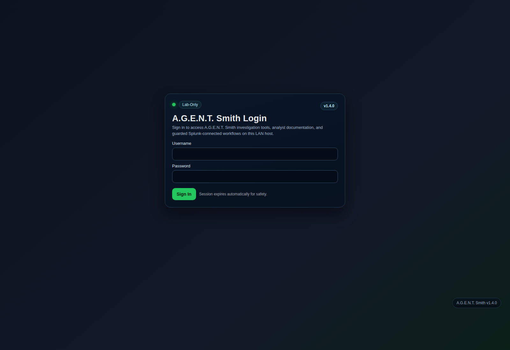
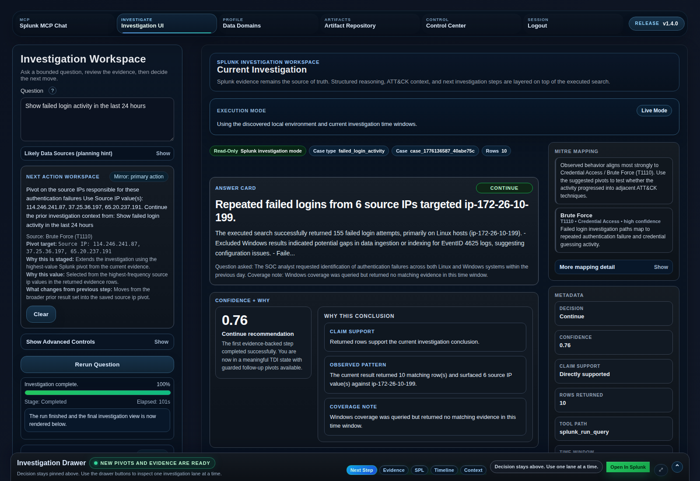
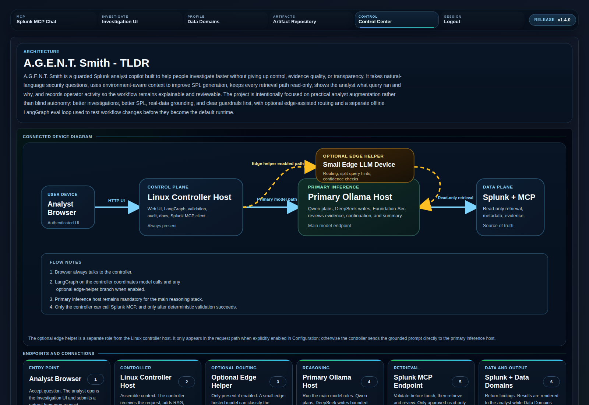
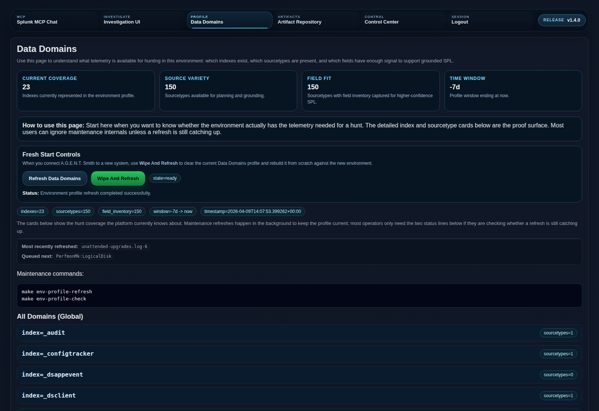
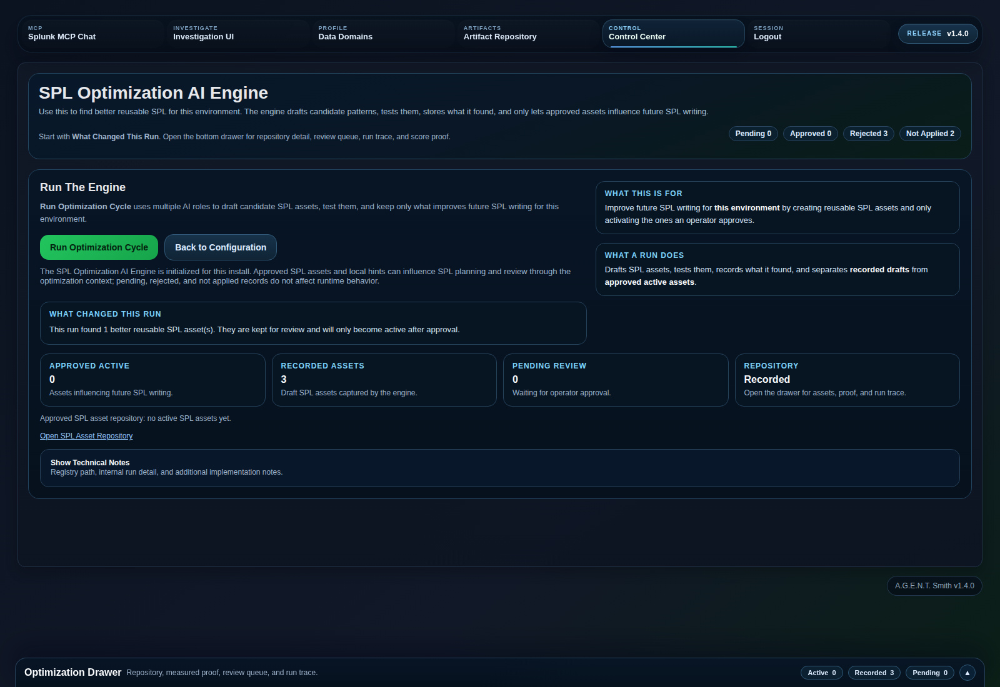

# A.G.E.N.T. Smith

Current release: `v1.4.0`

A.G.E.N.T. Smith is a guarded Splunk analyst copilot built for detection, triage, and investigation work. The project takes a natural-language question, plans a search strategy, writes bounded read-only SPL, validates that plan before it can touch Splunk, pulls back evidence through Splunk MCP, and returns the result with the executed query, evidence, and model reasoning visible. The goal is not blind autonomy. The goal is to help an analyst move faster without losing control of the workflow.

This repository is published as a clean starting point. It ships with example configuration, not live environment secrets or local runtime state.

For a short operator-facing summary of what changed in `v1.4.0`, read [v1.4.0 Release Highlights](docs/project/v1_4_0_delta.md).

## Start Here
If you are trying to get the platform running for the first time, read the [Initial Setup Guide](docs/runbooks/initial_setup.md) alongside the quick start below.

If you want the shortest explanation of the project before you install anything, start with:
- [One-Page White Paper](docs/whitepapers/project_one_page_white_paper.md)
- [Technical Deep Dive](docs/whitepapers/technical_deep_dive.md)
- [Changelog](CHANGELOG.md)

## Quick Start
For a clean first run, use the deployment container:

```bash
sudo apt-get update
sudo apt-get install -y git curl make docker.io docker-compose-v2
sudo systemctl enable --now docker
sudo usermod -aG docker $USER
newgrp docker
```

`$USER` is the current shell username. You do not need to replace it manually.

If `newgrp docker` fails because the shell session does not see the new group yet, sign out and back in once, then re-run `docker --version` and `docker compose version`.

If `docker-compose-v2` is unavailable on your distro, use the compatibility fallback in the [Initial Setup Guide](docs/runbooks/initial_setup.md).

Then:

```bash
git clone https://github.com/gosplunk/agtsmith.git
cd agtsmith
make docker-deploy-build
make docker-deploy-up
```

Then:
- open `http://HOST_IP:8787/login`
- complete first-run setup
- follow the [Initial Setup Guide](docs/runbooks/initial_setup.md) if you need the full environment checklist
- validate Ollama, Splunk Base, and Splunk MCP in `Control Center -> Configuration`
- pull and assign any missing models
- refresh Data Domains
- run the first investigation

## Screenshots
These screenshots reflect the current `v1.4.0` interface.

### Login
`v1.4.0` login flow for the analyst console.



### Investigation Workspace
`v1.4.0` Splunk-first investigation workflow with a decision-first answer card, confidence-backed recommendation, one primary next action, and inline trust validation.



### Architecture View
`v1.4.0` system architecture and role separation view for the bounded Splunk investigation pipeline.



### Data Domains And Personalization
`v1.4.0` environment-aware Data Domains view showing local index and sourcetype discovery, current coverage, and grounded planning support built from the live Splunk environment.



### SPL Optimization AI Engine
`v1.4.0` SPL Optimization AI Engine showing run controls, what changed this run, repository state, and reusable SPL asset workflow.



## How It Works
The default SPL path is a split-role pipeline:

1. `Planner`
   - default: `hf.co/MaziyarPanahi/Qwen3-30B-A3B-Instruct-2507-GGUF:Q4_K_M`
   - interprets the question and builds a structured search plan
2. `SPL Writer`
   - default: `deepseek-coder-v2:lite`
   - turns the plan into bounded read-only SPL
3. `Security Reviewer`
   - default: `hf.co/fdtn-ai/Foundation-Sec-8B-Reasoning-Q8_0-GGUF:latest`
   - performs security-oriented critique before deterministic validation
4. `Evidence Reviewer / Final Summary`
   - default: `hf.co/fdtn-ai/Foundation-Sec-8B-Reasoning-Q8_0-GGUF:latest`
   - judges returned evidence quality and produces the analyst-facing narrative

If the reviewer approves the query cleanly, the controller can skip extra adjudication and move straight to validation.

An optional small-model helper on an edge device can also be enabled for low-cost routing or split-query hints. It is not the main writer or reviewer path.

## What This Project Is
- A Splunk-centric analyst augmentation project
- Read-only by design
- Controller-hosted orchestration with visible decision steps
- Grounded in local environment metadata, Data Domains, and curated SPL references
- Built to be tuned empirically with benchmarks and evals

## What's New In v1.1.0
- SPL Optimization AI Engine with reviewable, airgapped environment-specific memory
- Stronger Linux auth, Windows auth, Apache, and mixed-platform investigation handling
- Improved Investigation UI result rendering, progress visibility, and operator feedback
- Pilot benchmark pack and full-pipeline hardening harness for BOTSv3 and live-environment testing

## What's New In v1.2.0
- redesigned the Investigation workspace into a desktop-first two-column layout with a sticky control rail and dominant results column
- added richer ATT&CK investigation support: hover definitions, ATT&CK pivots, follow-on technique context, persisted ATT&CK bundles, and model-backed ATT&CK validation
- improved investigation state handling so in-progress runs show pending state and zero-row completions produce a bounded no-evidence outcome
- improved follow-up usability with a Pivot Drawer, visually distinct follow-up execution, hidden-by-default advanced controls, and collapsed SPL sample results
- added ATT&CK logic benchmarks for BOTSv3-oriented investigation logic validation
- added built-in HTTPS support and masked Splunk token handling in Configuration
- sanitized shipped defaults so environment-specific URLs and local learned assumptions are not baked into the public repo

## What's New In v1.2.1
- aligned the live investigation runtime to the saved Configuration role assignments instead of falling back to process defaults
- moved security review, evidence review, continuation review, and final summary to `Foundation-Sec-8B-Reasoning` while keeping `Qwen` for planning and `deepseek-coder-v2:lite` for SPL generation and repair
- updated the docs, architecture graphs, and model strategy guidance to reflect the split-role investigation pipeline
- added a canonical next-release planning document for `v1.3.0`, including persistent follow-up context as a planned standard-pivot enhancement
- fixed the runtime configuration save flow so changing Ollama/Splunk hosts does not leave the UI stuck on `Saving...`

## What's New In v1.2.3
- clarified SPL Optimization AI Engine so the operator can see which learning mode ran and why a no-gain run finished without keeping new hints
- added explicit learned-state, benchmark cache, candidate filtering, and run-duration feedback to the Learning page
- fixed the Learning page so `Run Optimization Cycle` is no longer blocked by the admin onboarding modal or by a client-side JavaScript parse error

## What's New In v1.2.4
- redesigned the Investigation Drawer into a sticky Splunk-first analyst workbench with action-first tabs for pivots, evidence, SPL, ATT&CK context, and decision tracing
- added stronger investigation trust cues including left-rail phase status, improved long-running guidance, richer Splunk handoff, and row-level drill-down from evidence back into Splunk
- turned SPL Optimization into a repository-backed workflow with reusable SPL assets, explicit approval flow, and a dedicated SPL Asset Repository review surface
- reorganized Control Center pages around current state, next action, and working context so configuration, audit, environment coverage, and artifacts are easier to scan
- refreshed the public screenshots so GitHub matches the current product surface
- added persistent case timelines with saved investigation and pivot nodes, a dedicated Case Workspace, and PostgreSQL-backed case memory for reopening prior findings without rerunning Splunk

## What's New In v1.3.1
- made query grounding materially more environment-native by learning field inventory per `index + sourcetype`, selecting authoritative local domains from Data Domains, and rewriting generic canonical SPL toward the live environment instead of assuming generic index names
- fixed several analyst-facing investigation paths so successful login activity, Apache 404s, suspicious user agents, Linux session activity, Office 365 management activity, and CloudTrail activity route through the same environment-aware validation and execution flow used in the running product
- upgraded investigation continuity into a durable case workflow with PostgreSQL-backed case memory, structured pivot context, persistent case/node ids, and an Investigation Timeline that can reopen original findings and deeper pivots without rerunning Splunk
- added a stronger analyst reasoning surface in the Investigation Drawer, including narrative continuity, richer timeline cards, clickable step restore behavior, and stateful pivot continuation
- hardened current assessment output so fallback summaries remain useful and evidence-aware when the final-summary model fails or times out

## What's New In v1.3.5
- fixed `/api/ask` so optional post-run enrichment and case persistence fail open instead of returning HTTP 500 after a successful investigation result already exists
- surfaced multi-model summary diagnostics in the runtime result shape, including `summary_fallback_used`, `summary_error`, and `summary_quality_reason`
- clarified new-box setup guidance in both the public Initial Setup Guide and the live Configuration page so operators refresh Data Domains and run real investigations before starting SPL Optimization
- retained green `Open In Splunk` handoff in the Investigation drawer and MCP chat client, and restored clickable evidence-row drilldown so analysts can jump directly back into Splunk from returned sample rows
- removed the unintended fallback default UI credential path so a new deployment no longer invents `analyst/changeme123!` before first-run setup
- restored the intended first-run bootstrap flow so `/login` redirects to `/setup/first-run` until the initial operator account is created
- fixed MCP chat and investigation query execution after Configuration changes by resolving `SPLUNK_MCP_URL` from current runtime config on each call instead of using a stale startup-time value
- fixed Splunk handoff URL resolution so explicit `SPLUNK_WEB_URL` overrides are honored correctly
- hardened `Open In Splunk` and clickable evidence-row drilldown across different A.G.E.N.T. Smith hosts by trying more than one reasonable Splunk Web URL when no explicit override is configured
- added deterministic Splunk Web auto-detection that derives the host from Splunk MCP/base settings and probes `https://HOST:8000` first, then `http://HOST:8000`
- persisted auto-detected `SPLUNK_WEB_URL` during Configuration saves so working handoff targets remain stable across restarts
- surfaced Splunk Web handoff validation explicitly in Configuration so operators can see whether `Open In Splunk` will render before they leave the page

## What's New In v1.4.0
- made `LLM-Assisted MCP` the default MCP experience while retaining deterministic MCP as an explicit fallback mode
- added clear `LLM-Assisted` vs `Deterministic` and `Live Mode` vs `Demo Mode` controls in MCP instead of a low-signal checkbox-style demo toggle
- rebuilt Investigation UI around one decision-first center flow: `Answer Card`, `Confidence + Why`, one dominant `Primary Next Action`, key evidence, and inline SPL trust validation
- demoted the left rail into a mirror/workspace surface so it no longer competes with the center continue action once a result is loaded
- turned evidence values and saved timeline entities into clickable pivot staging controls that preserve structured follow-up context instead of forcing manual copy/paste
- improved structured pivot continuity, saved-case reopening, and next-action copy so the analyst can see what changed from the prior step and when not to continue
- tightened environment-aware query grounding to avoid leaking web-style sourcetypes into failed-login auth searches and to rank authoritative local indexes and sourcetypes more intelligently
- added portable intent playbooks for deeper pivot recommendations across credential abuse, web hunting, endpoint network or DNS, privilege escalation, and cloud API identity investigations
- improved the `/learning` workflow so SPL Optimization shows clearer run status, what changed this run, pending review, approved assets, and stronger operator guidance before optimization starts
- updated the docs set with stable `v1.4.0` release notes and operator-facing highlights

## What It Is Not
- Autonomous response or recovery
- A SOAR platform
- Enterprise IAM or secret-management infrastructure
- HA/SLA-hardened production software

## Running It
There are three supported ways to run A.G.E.N.T. Smith.

1. Host runtime
- Runs the app directly from the local Python environment on the current machine.
- Best for development, debugging, and fast iteration when you are changing code often.

```bash
make dev
```

2. Docker wrapper
- Runs A.G.E.N.T. Smith in Docker, but still uses the local working tree.
- Best when you want containerized execution without giving up live local code changes.

```bash
make docker-build
make docker-up
```

3. Docker deployment image
- Builds and runs the cleaner deployment-style version of A.G.E.N.T. Smith.
- Uses isolated config and artifact volumes instead of your host runtime state.
- This is the recommended path for a fresh install, a demo box, or a handoff to another machine.

```bash
make docker-deploy-build
make docker-deploy-up
```

If your host user is not UID/GID `1000`, set:
```bash
export AGTSMITH_UID=$(id -u)
export AGTSMITH_GID=$(id -g)
```

### HTTPS
The built-in web server can now serve HTTPS directly when both of these environment variables are provided to the runtime:

- `AGTSMITH_TLS_CERT_FILE`
- `AGTSMITH_TLS_KEY_FILE`

For trusted browser sessions on real hosts, the recommended deployment pattern is still a reverse proxy with a certificate chain the browser already trusts.

## First-Time Setup
The recommended path is Docker-first.

1. Start the deployment container.
2. Open `http://HOST_IP:8787/login`.
3. Complete first-run bootstrap if prompted.
4. Open `Control Center`.
5. Follow the Initial Setup Guide from the Configuration page.
6. Validate Ollama, Splunk Base, and Splunk MCP.
7. Pull and assign any missing models.
8. Run `Refresh Data Domains` and let the initial environment build complete.
9. Run the first investigation.

Deployment notes:
- the deploy image uses its own config volume
- the deploy image uses its own artifact volume
- it does not read the host `config/ui.env` unless you deliberately change the compose file
- it does not inherit host-built Data Domains or personalization artifacts

## Key Routes
- Investigation UI: `/investigation`
- Case Workspace: `/cases`
- MCP Chat: `/mcp`
- SPL Optimization AI Engine: `/learning`
- SPL Asset Repository: `/spl-assets`
- Configuration: `/configure`
- Architecture: `/architecture`
- LangGraph Graph: `/langgraph-graph`
- Documentation: `/docs`
- Data Domains: `/environment`

## Configuration
Tracked example config:
- `config/ui.env.example`

Local operator config:
- `config/ui.env`

Public repo rule:
- do not commit a live `config/ui.env`
- a clean deployment should enter first-run setup and be configured locally

Runtime query audit:
- `artifacts/audit/query_runs.jsonl`

Role model:
- `analyst` can investigate but cannot change runtime settings
- `ops` can manage runtime configuration, models, validation, and Data Domains
- `admin` includes `ops` access plus user management and query audit visibility

For the two-model SPL path:
- `OLLAMA_MODEL_QUERY_PLANNER` should point to the reasoning/planning model
- `OLLAMA_MODEL_QUERY_WRITER` should point to the coding-focused SPL writer
- `OLLAMA_MODEL_QUERY_REPAIR` can use the same coding model as the writer
- `EDGE_LLM_ENABLED=1` is only for the optional edge helper path

If you are running the host/manual path and want to start from the example file:
```bash
cp config/ui.env.example config/ui.env
```

For the recommended Docker deployment path, this is not required. The clean deploy flow uses first-run setup and Docker volumes instead.

## Benchmarks And Evals
The project includes two main feedback loops.

### SPL hardening
```bash
make spl-hardening-benchmark
```

You can target a specific family or case while tuning:
```bash
python3 scripts/run_spl_hardening_benchmark.py --family linux_auth_failures
python3 scripts/run_spl_hardening_benchmark.py --case-id windows_failed_logons_24h
```

### LangGraph topology evals
```bash
make langgraph-gold-build
make langgraph-eval-prompts
make langgraph-topology-eval
make langgraph-topology-optimize
```

These runs are meant to answer a practical question: does the workflow actually improve when you change the topology, prompts, or model split?

### ATT&CK logic benchmark
```bash
python3 scripts/build_attack_logic_benchmark_pack.py
python3 scripts/run_attack_logic_benchmark.py
```

This benchmark track validates ATT&CK-oriented investigation logic, pivot generation, and technique mapping without treating BOTSv3 as modern threat ground truth.

## BOTSv3
BOTSv3 is included as a separate benchmark track, not as a production assumption. Its timestamps are historical, so those cases use explicit all-time handling only when the question says so.

Run it with:
```bash
make spl-hardening-benchmark-botsv3
make spl-hardening-benchmark-botsv3-inventory
```

## Roadmap
Near-term work is focused on making the current investigation loop stronger, not turning the project into a different product.

For the current planned-release view, including committed next-step work and known gaps, see:
- [Next Release Plan](docs/project/next_release_plan.md)

- Better mixed-platform handling for prompts that span Windows and Linux in one question
- Deeper multi-step investigations with stronger bounded continuation, clearer pivot logic, and better evidence review
- Broader LangGraph topology eval coverage so routing and review changes are measured before they become defaults
- Stronger Linux query quality and repair behavior, especially around auth, sudo/su, and audit-style searches
- More explicit runtime observability so operators can see what was validated, what actually ran, and why a branch was skipped
- Stronger authentication, session controls, and operator access boundaries
- HTTPS-ready deployment guidance and reverse-proxy support for safer multi-user access
- A practical edge-helper path for cheap routing and split-query hints without moving the main planner/writer/reviewer flow off the primary inference host
- Optional Splunk SOAR integration for downstream handoff or controlled action workflows, without changing the project’s default read-only posture
- Continued documentation cleanup so first-time installs and operator workflows are easier to follow without hidden assumptions

## Docs Reading Order
1. `docs/whitepapers/project_one_page_white_paper.md`
2. `docs/whitepapers/technical_deep_dive.md`
3. `docs/runbooks/initial_setup.md`
4. `docs/runbooks/health_check.md`
5. `docs/architecture/two_model_spl_pipeline.md`
6. `docs/architecture/system_design.md`
7. `docs/project/next_release_plan.md`

## Default Model Assignments
```bash
export OLLAMA_MODEL_QUERY_PLANNER="hf.co/MaziyarPanahi/Qwen3-30B-A3B-Instruct-2507-GGUF:Q4_K_M"
export OLLAMA_MODEL_QUERY_WRITER="deepseek-coder-v2:lite"
export OLLAMA_MODEL_SECURITY_REVIEWER="hf.co/fdtn-ai/Foundation-Sec-8B-Reasoning-Q8_0-GGUF:latest"
export OLLAMA_MODEL_EVIDENCE_REVIEWER="hf.co/fdtn-ai/Foundation-Sec-8B-Reasoning-Q8_0-GGUF:latest"
export OLLAMA_MODEL_PEER_REVIEWER="hf.co/MaziyarPanahi/Qwen3-30B-A3B-Instruct-2507-GGUF:Q4_K_M"
export OLLAMA_MODEL_PEER_REVIEWER_2="hf.co/MaziyarPanahi/Qwen3-30B-A3B-Instruct-2507-GGUF:Q4_K_M"
export OLLAMA_MODEL_AGENTIC_CONTINUATION_REVIEWER="hf.co/fdtn-ai/Foundation-Sec-8B-Reasoning-Q8_0-GGUF:latest"
export OLLAMA_MODEL_FINAL_SUMMARY="hf.co/fdtn-ai/Foundation-Sec-8B-Reasoning-Q8_0-GGUF:latest"
export OLLAMA_MODEL_QUERY_REPAIR="deepseek-coder-v2:lite"
```

Pull the default local model set:
```bash
ollama pull hf.co/MaziyarPanahi/Qwen3-30B-A3B-Instruct-2507-GGUF:Q4_K_M
ollama pull deepseek-coder-v2:lite
ollama pull hf.co/fdtn-ai/Foundation-Sec-8B-Reasoning-Q8_0-GGUF:latest
```

## License
This project is licensed under the Apache License 2.0. See `LICENSE`.
