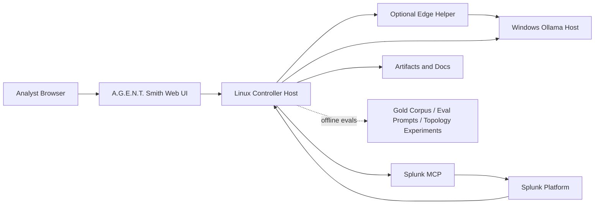

# Network Diagram

This document is the topology view. It is intentionally short. Read it when you want to understand how the runtime nodes connect to each other.

## Node Roles
- Analyst Browser:
  - authenticated UI access
- Linux Controller Host:
  - web server, LangGraph orchestration, guardrail checks, artifact handling
- Windows Ollama Host:
  - model inference
- Optional Edge Helper:
  - small-model assist path for routing, question splitting, and low-cost prechecks
  - not the primary SPL writer or reviewer
- Splunk MCP:
  - bounded read-only tool interface
- Splunk Platform:
  - telemetry and metadata source of truth
- Gold Corpus / Eval Prompts / Topology Experiments:
  - offline optimization layer
  - not in the live request path
  - used to compare LangGraph layouts empirically

## Ports And Access
- Web UI: `8787`
- Ollama API: `11434`
- Splunk management and MCP path: `8089` and `/services/mcp`

## Connection Notes
- The controller is the only system that talks to both Ollama and Splunk MCP
- The user does not talk to Ollama or Splunk directly through the browser
- The offline eval harness also runs from the controller side, but it is separate from the live analyst path
- Docker deployments keep `Data Domains` hidden until Splunk MCP validates and the first environment profile build completes

## Trust Boundaries
- Browser to UI: authenticated session boundary
- Controller to Ollama: inference boundary
- Controller to Splunk MCP: data-access boundary
- Splunk itself remains the evidence source of truth
