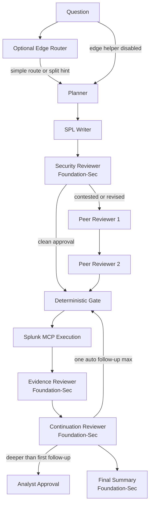

# A.G.E.N.T. Smith - System Design

## Purpose
This document is the concise implementation reference for A.G.E.N.T. Smith. It describes the current runtime components, the control model, and the boundary between what exists today and what is planned later.

## Current Runtime
- Controller node: Linux host, for example a Raspberry Pi or small server
- Primary inference node: Windows host running Ollama
- Optional edge inference helper: small LLM on an edge device for lightweight routing, question splitting, and confidence pre-checks
- Data plane: Splunk plus Splunk MCP
- User surface: authenticated web UI, documentation portal, architecture page, and artifact browser
- Offline optimization plane: gold-corpus, eval-prompt, and topology-experiment runner used to tune LangGraph outside the live request path

```mermaid
flowchart LR
    A[Analyst Question] --> B[Linux Controller Host]
    B --> C[LangGraph Orchestration]
    C --> D[Qwen Planner + DeepSeek Writer + Foundation-Sec Review]
    D --> E[Deterministic Policy Gate]
    E --> F[Splunk MCP]
    F --> G[Splunk Data]
    G --> H[Evidence Reviewer<br/>Foundation-Sec]
    H --> I[Continuation Control<br/>Foundation-Sec]
    I --> J[Final Summary<br/>Foundation-Sec]
    J --> K[Analyst UI]
```

## Responsibilities By System
### Linux Controller Host
- Runs the web server and session-auth layer
- Handles first-run credential bootstrap and local user management
- Records query audit entries for web-triggered investigations
- Executes LangGraph orchestration
- Applies deterministic policy and tool validation
- Calls Splunk MCP and assembles the analyst response
- Serves documentation and artifacts

### Windows Ollama Host
- Runs the assigned LLM roles
- Provides remote inference over LAN

### Optional Edge LLM Helper
- Runs a small model close to the controller on an edge device
- Is explicitly optional and disabled by default in runtime configuration
- Best suited for:
  - intent pre-classification
  - Windows/Linux/web/cloud routing
  - split-query planning for cross-platform questions
  - low-cost confidence or escalation hints
- Does not replace the primary planner, SPL writer, or reviewer path on the main inference host

### Splunk And Splunk MCP
- Provide read-only retrieval
- Provide metadata for Data Domains
- Remain the source of truth for evidence

## Active Model Roles
- Planner: Qwen
- SPL Writer: DeepSeek
- Security Reviewer: Foundation-Sec
- Peer Reviewer 1 when needed: Qwen
- Peer Reviewer 2 when needed: Qwen
- Evidence Reviewer: Foundation-Sec
- Continuation Reviewer: Foundation-Sec
- Final Summary: Foundation-Sec
- Optional Edge Router / Splitter

## Control Model
- Agent roles collaborate, critique, and summarize
- The controller validates execution before Splunk tool access
- A small edge model can optionally classify or split questions before the main planner runs
- Splunk access is bounded to approved read-only paths
- One automatic continuation pass is allowed
- Deeper continuation requires analyst approval
- Fail-closed guardrails prevent unsafe execution
- Peer-review stages are conditional and only run when the reviewer does not cleanly approve the writer output

## Data And RAG Layers
- Portable RAG ships with the product
- Data Domains are built from the live Splunk environment
- Personalization merges portable RAG with the environment profile
- Query writing, repair, and validation use the resulting skillpack

## Local Access And Audit
- First-run setup creates the initial local operator account before the rest of the UI is exposed
- Local roles are split as:
  - `analyst`: investigations only
  - `ops`: runtime configuration, validation, model assignment, and Data Domains controls
  - `admin`: all `ops` access plus local user management and query audit visibility
- Web-triggered investigations append a query audit record with operator identity, question, selected tool, and executed SPL when available
- This is local runtime access control and auditability, not enterprise IAM

## Current Scope
- Detect: implemented
- Triage: implemented
- Investigate: implemented
- Respond: manual only
- Recover: manual only
- SOAR: planned only

## Offline Optimization Layer
- Gold corpus generation uses the live LangGraph pipeline to capture reference intent, tool choice, SPL shape, and result behavior.
- Eval prompt generation derives wording variants from those gold cases.
- Topology experiments toggle reviewer, peer review, evidence review, summary, and repair stages offline.
- Experiment scoring compares support rate, intent match, query shape, result fields, row behavior, and latency.
- This layer improves the controller workflow without changing the live runtime path by default.

## Planned Next Layers
- Governed response orchestration
- SOAR and playbook dispatch
- Stronger identity and secret handling
- Deeper case memory and continuity
- Broader metrics and benchmarking
- Optional edge-assisted routing and split-query planning for low-latency classification
