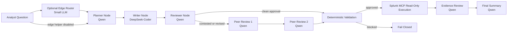

# Two-Model SPL Pipeline

## Overview

A.G.E.N.T. Smith now uses a two-model path for SPL generation:

- `Planner / Reviewer`: `hf.co/MaziyarPanahi/Qwen3-30B-A3B-Instruct-2507-GGUF:Q4_K_M`
- `SPL Writer`: `deepseek-coder-v2:lite`

An optional helper layer can sit in front of that path:
- `Edge Router / Splitter`: small LLM on an edge device for cheap question classification and cross-platform split hints

The goal is simple:
- use the reasoning model for intent interpretation and critique
- use the coding model for SPL composition
- trust deterministic validation more than either model

In the UI, the live workflow view is available from:
- `Control Center -> LangGraph Graph`

## Node Flow



## Stage Responsibilities

### Planner
- understands analyst intent
- identifies likely indexes, sourcetypes, and fields
- proposes the search strategy
- does not own final SPL generation

### Optional Edge Router / Splitter
- classifies lightweight questions cheaply
- helps detect split-query cases such as Windows plus Linux in one prompt
- can emit a suggested normalized output schema before the main planner runs
- should not replace the primary planner, writer, or reviewer roles

Output shape:
- intent
- intent summary
- search strategy summary
- likely indexes
- likely sourcetypes
- likely fields
- tool choice
- bounded time / row constraints

### SPL Writer
- receives the structured plan
- generates bounded read-only SPL
- focuses on:
  - command ordering
  - field handling
  - `stats` / `eval` usage
  - practical query composition

### Reviewer
- checks whether the writer output matches the planner intent
- flags bad assumptions
- proposes safer or better read-only rewrites
- can send the query straight to deterministic validation when it cleanly approves the writer output

### Deterministic Validation
- blocks unsafe behavior
- enforces read-only queries
- checks intent contract
- checks environment bindings
- fails closed before Splunk execution

## Safety Model

The safety boundary is deterministic, not model-trusted.

Validation layers:
1. policy validation
2. intent contract validation
3. environment-profile validation

If any layer fails:
- the query does not run
- the system returns a blocked result
- optional single-pass repair can run before final rejection

## Configuration

Primary environment variables:

```bash
OLLAMA_MODEL_QUERY_PLANNER=hf.co/MaziyarPanahi/Qwen3-30B-A3B-Instruct-2507-GGUF:Q4_K_M
OLLAMA_MODEL_QUERY_WRITER=deepseek-coder-v2:lite
OLLAMA_MODEL_SECURITY_REVIEWER=hf.co/MaziyarPanahi/Qwen3-30B-A3B-Instruct-2507-GGUF:Q4_K_M
OLLAMA_MODEL_EVIDENCE_REVIEWER=hf.co/MaziyarPanahi/Qwen3-30B-A3B-Instruct-2507-GGUF:Q4_K_M
OLLAMA_MODEL_PEER_REVIEWER=hf.co/MaziyarPanahi/Qwen3-30B-A3B-Instruct-2507-GGUF:Q4_K_M
OLLAMA_MODEL_PEER_REVIEWER_2=hf.co/MaziyarPanahi/Qwen3-30B-A3B-Instruct-2507-GGUF:Q4_K_M
OLLAMA_MODEL_QUERY_REPAIR=deepseek-coder-v2:lite
OLLAMA_MODEL_FINAL_SUMMARY=hf.co/fdtn-ai/Foundation-Sec-8B-Reasoning-Q8_0-GGUF:latest
```

Optional edge-helper variables supported now:
- `EDGE_LLM_ENABLED`
- `EDGE_LLM_HOST`
- `EDGE_LLM_MODEL`
- `EDGE_LLM_ROLE`
- `EDGE_LLM_TIMEOUT_SEC`

Recommended behavior:
- leave the edge helper disabled by default
- enable it only when you have a small edge-hosted model dedicated to routing or split-query hints
- do not assign planner, writer, or reviewer duties to this helper slot

## Logging

The LangGraph state now records human-readable stage logs for:
- guardrail
- planner
- writer
- reviewer
- peer review 1 when needed
- peer review 2 when needed
- validation
- execution
- evidence review
- summary

These logs are intended to explain what the system is doing, not just dump raw model text.

## Offline Eval Loop

The project now also includes an offline LangGraph optimization harness:

- build a gold corpus from seed questions using the live workflow
- derive prompt variants from those reference cases
- run multiple topology permutations against the prompt set
- compare score, support rate, intent match, and latency

See:
- [langgraph_eval_optimization.md](langgraph_eval_optimization.md)

## Why This Split Helps

This separation makes failure modes easier to diagnose:
- if intent is wrong, fix the planner/reviewer prompts
- if SPL syntax or composition is weak, fix the writer or writer examples
- if risky behavior slips through, tighten deterministic validation
- if split-query decomposition is weak, improve the optional edge router or the planner handoff

That is a better engineering boundary than asking one model to reason, write, critique, and repair everything alone.
