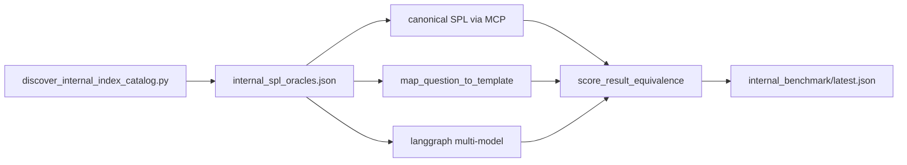

# Internal Indexes SPL Benchmark

Environment-portable benchmark for Splunk platform ops questions scoped to `_internal`, `_audit`, and `_introspection`. Phase 1 uses data already present on every Splunk instance—no synthetic ingest required.

## Purpose

Validate that agtsmith produces near-perfect SPL for internal-index questions:

- sourcetype and host inventory in `_internal`
- scheduler, splunkd, forwarder, and license telemetry
- Splunk auth failures in `_audit`

The harness compares **canonical SPL** (hand-validated oracle) against the **template/deterministic path** on every run, and optionally the **full LLM-assisted pipeline** for nightly or pre-release gates.

## Architecture



## Oracle corpus

Committed cases live in [`benchmarks/internal_spl_oracles.json`](../../benchmarks/internal_spl_oracles.json).

Each case includes:

| Field | Role |
|-------|------|
| `index_scope` | Expected index (`_internal`, `_audit`, `_introspection`) |
| `sourcetype_tags` | Required sourcetype filters when applicable |
| `canonical_spl` | Hand-validated gold query |
| `compare_fields` | Row-set equivalence dimensions |
| `min_equivalence_score` | Pass threshold for live MCP runs |
| `data_present_required` | When false, zero-row canonical results do not fail the gate |

Seed new cases offline with catalog + briefs:

```bash
make internal-spl-discover
PYTHONPATH=.:scripts .venv/bin/python scripts/build_internal_spl_oracles.py --merge-existing
```

## Run instructions

```bash
# Refresh live internal index catalog (MCP)
make internal-spl-discover

# Offline routing/policy/structure gate (no MCP, runs in make check)
make check-internal-spl-oracles
make internal-spl-accuracy-offline

# Live template path (canonical vs template, MCP execution)
make internal-spl-accuracy

# Full LLM pipeline — run on demand when you want it (not scheduled)
make internal-spl-accuracy-multimodel
```

Artifacts:

- Catalog: `artifacts/environment/internal_index_catalog.json`
- Benchmark report: `artifacts/spl_autonomy/internal_benchmark/latest.json`
- History: `artifacts/spl_autonomy/internal_benchmark/history/run_*.json`

## Failure taxonomy

| Bucket | Typical fix location |
|--------|----------------------|
| `routing_wrong_intent` | `minimal_question_to_answer`, `question_intelligence` |
| `wrong_index_scope` | `query_templates`, `spl_domain_knowledge` |
| `wrong_sourcetype_filter` | templates, `_dynamic_query_for_question` |
| `wrong_aggregation_dimension` | templates, analytical plan compiler |
| `metadata_tool_instead_of_search` | `determine_splunk_tool`, alignment overrides |
| `llm_drift_from_template` | writer prompts, domain cards, template override mode |
| `zero_rows_canonical_ok_agent_bad` | SPL shape bug in template path |
| `both_zero_rows` | mark `data_present_required=false` or refresh catalog |

## Phase SLOs

| Phase | Template path | Full LLM path |
|-------|---------------|---------------|
| Phase 1 exit | ≥90% | ≥80% |
| Phase 2 exit | 100% | ≥95% |

Track trend in `artifacts/spl_autonomy/internal_benchmark/history/`.

## CI integration

`make check` runs:

- `check-internal-spl-oracles` — offline corpus validation
- `internal-spl-accuracy-offline` — routing, policy, tool, and structural checks

`spl-autonomy-nightly` does **not** run internal benchmarks automatically. Use the Makefile targets above when you want live or multimodel validation.

## Related docs

- Phase 3 expansion tracks (lab data, pretrained sourcetypes, BOTSv3): [`internal_spl_phase3.md`](internal_spl_phase3.md)
- Live domain benchmark (non-internal indexes): [`live_domain_spl_benchmark.md`](live_domain_spl_benchmark.md)
