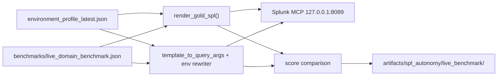

# Live Domain SPL Benchmark

Environment-portable SPL benchmark methodology that renders gold queries from the live environment profile at runtime — never from hardcoded `index=linux` fixtures.

## Purpose

Validate that agtsmith's SPL pipeline (`map_question_to_template` → `template_to_query_args` → `apply_environment_query_constraints`) produces queries grounded in **actual** indexes and sourcetypes present in the deployment, compared against profile-resolved gold oracles.

## Architecture



### Key design principles

1. **Profile as single source of truth** — `resolve_authoritative_domains_for_question()` selects indexes/sourcetypes; gold SPL is rendered from resolved domains, not checked-in fixtures.
2. **Benchmark spec is intent + hints only** — `benchmarks/live_domain_benchmark.json` stores questions, intents, domain hints, and validation criteria. Gold SPL is written to artifacts at run time.
3. **Fallback when domain resolution fails** — if `resolve_authoritative_domains` returns empty (e.g. Windows with sparse field inventory), gold rendering falls back to `sourcetype_to_indexes` from the profile.
4. **Same questions, two paths** — gold (profile-rendered) vs agtsmith (template pipeline) executed via the same MCP credentials.

## Live environment profile (2026-07-22)

| Index | Role | Key sourcetypes |
|-------|------|-----------------|
| `linux` | Primary Linux auth | `auth.log` (2.5M events), `syslog` |
| `botsv3` | BOTSv3 mixed dataset | `access_combined`, `xmlwineventlog`, `linux_secure`, `syslog` |
| `main` | Host metrics | `cpu`, `Unix:Service`, `ps` |

No dedicated `index=windows` exists — Windows events live in `botsv3` under `xmlwineventlog` / `WinEventLog`.

## Benchmark cases

| ID | Theme | Intent | Gold index (resolved) | Gold sourcetype |
|----|-------|--------|----------------------|-----------------|
| `linux_auth_failures_24h` | auth | `linux_auth_failures` | `linux` | `auth.log` |
| `apache_access_top_ips_24h` | web | `apache_access_top_ips` | `botsv3` | `access_combined` |
| `linux_privilege_escalation_24h` | linux_priv | `linux_privilege_escalation` | `linux` | `auth.log` |
| `windows_failed_logon_4625_24h` | windows_auth | `windows_auth_failures` | `botsv3` | `xmlwineventlog` |
| `apache_404_spike_24h` | web_404 | `apache_404_spike` | `botsv3` | `access_combined` |

## Run instructions

```bash
# Full benchmark (gold + agtsmith, MCP execution)
make live-domain-benchmark

# Or directly:
PYTHONPATH=.:scripts .venv/bin/python scripts/run_live_domain_benchmark.py

# Offline compare only (no MCP)
make live-domain-benchmark-offline

# Row validation with profile-aligned window (optional)
PYTHONPATH=.:scripts .venv/bin/python scripts/run_live_domain_benchmark.py --earliest-time -7d

`make spl-autonomy-check` includes `live-domain-benchmark-offline` as a fast profile-driven gate before the pilot hardening subset.

# Full LangGraph pipeline instead of template path
PYTHONPATH=.:scripts .venv/bin/python scripts/run_live_domain_benchmark.py --use-full-pipeline

# Load case list from JSON instead of runtime profile filtering
PYTHONPATH=.:scripts .venv/bin/python scripts/run_live_domain_benchmark.py --cases-from-json
```

Credentials load from gitignored `config/ui.env` (`SPLUNK_LAB_BEARER_TOKEN`).

Artifacts land in `artifacts/spl_autonomy/live_benchmark/<timestamp>/`:
- `report.json` — full comparison per case
- `report.md` — human-readable gap table and SPL diffs
- `rendered_benchmark.json` — profile-rendered gold SPL snapshot

## Results — 2026-07-28 run (post P0 hotfix)

**Profile:** `artifacts/environment/environment_profile_latest.json` (2026-07-22, 16 indexes)  
**Artifact:** `artifacts/spl_autonomy/live_benchmark/20260728T144639Z/report.json`  
**Cases source:** runtime profile filtering (portable; no hardcoded indexes)

| Case | Score | Index match | Coherence | Gold rows | Agtsmith rows | Key finding |
|------|-------|-------------|-----------|-----------|---------------|-------------|
| linux_auth_failures_24h | 90 | yes `linux` | yes | 0 | 0 | agtsmith adds `sourcetype=syslog`; zero rows in -24h window |
| apache_access_top_ips_24h | 90 | yes `botsv3` | yes | 0 | 0 | Perfect SPL shape match; zero rows in -24h |
| linux_privilege_escalation_24h | 100 | yes `linux` | yes | 0 | 0 | Full structural match |
| windows_failed_logon_4625_24h | **100** | yes `botsv3` | yes | 0 | 0 | **Fixed** — both gold and agtsmith use `index=botsv3 sourcetype=XmlWinEventLog` |
| apache_404_spike_24h | 100 | yes `botsv3` | yes | 0 | 0 | Perfect match |

**Summary:** avg score **96.0**, pass rate (≥85) **100%** (5/5).

### Failed logons smoke (P0 hotfix)

Question: `"Failed logons in the last 24 hours"`

| Check | Result |
|-------|--------|
| Intent | `linux_auth_failures` (not `failed_login_activity` with Windows append) |
| Index | `index=linux` (gold and agtsmith match) |
| No EventCode 4625 | yes |
| No `\| append [` cross-platform merge | yes |
| Platform coherence | yes |

**Gold SPL:**
```spl
search index=linux sourcetype=auth.log ("Failed password" OR "authentication failure" OR "Invalid user" OR "Connection closed by invalid user" OR "FAILED SU") | rex field=_raw "(?i)Failed password for (?:invalid user )?(?<user>[^ ]+)" | rex field=_raw "(?i)user=(?<pam_user>[^\s;]+)" | rex field=_raw "(?i)from (?<failed_src_ip>\d{1,3}(?:\.\d{1,3}){3}) port (?<failed_port>\d+)" | rex field=_raw "(?i)rhost=(?<rhost>[^\s;]+)" | eval user=coalesce(user,pam_user,username,account) | eval src_ip=coalesce(src_ip,failed_src_ip,rhost,src,ip,"local") | eval port=coalesce(port,failed_port,lport) | stats count by host user src_ip port | sort - count
```

**Agtsmith SPL:**
```spl
search index=linux (sourcetype=auth.log OR sourcetype=syslog) ("Failed password" OR "authentication failure" OR "Invalid user" OR "Connection closed by invalid user" OR "FAILED SU") | rex field=_raw "(?i)Failed password for (?:invalid user )?(?<user>[^ ]+)" | rex field=_raw "(?i)user=(?<pam_user>[^\s;]+)" | rex field=_raw "(?i)from (?<failed_src_ip>\d{1,3}(?:\.\d{1,3}){3}) port (?<failed_port>\d+)" | rex field=_raw "(?i)rhost=(?<rhost>[^\s;]+)" | eval user=coalesce(user,pam_user,username,account) | eval src_ip=coalesce(src_ip,failed_src_ip,rhost,src,ip,"local") | eval port=coalesce(port,failed_port,lport) | stats count by host user src_ip port | sort - count
```

Difference: agtsmith broadens sourcetype to include `syslog` via `apply_environment_query_constraints`.

### Gap table

| Gap | Severity | Evidence | Root cause |
|-----|----------|----------|------------|
| Zero-row execution in -24h | Medium | All 5 cases return 0 rows despite profile showing millions of events over -7d | Profile snapshot uses `-7d`; benchmark queries use `-24h`; likely no events in the most recent 24 hours for these sourcetypes |
| Sourcetype broadening (linux) | Low | agtsmith adds `OR sourcetype=syslog` alongside `auth.log` | `apply_environment_query_constraints` expands sourcetype clause from ranked domain list |
| ~~Windows index not rewritten~~ | ~~Critical~~ | **Resolved** — windows case now scores 100 with `index=botsv3` | P0 hotfix: domain resolution + env rewriter now ground Windows intents to profile indexes |

## Comparison metrics

Per case, the runner computes:

| Metric | Description |
|--------|-------------|
| `index_match` | Exact set equality of `index=` clauses between gold and agtsmith |
| `sourcetype_coherence` | `validate_platform_sourcetype_coherence()` — no Windows EventCode in Linux branches |
| `required_terms_present` | agtsmith query contains all case `required_terms` |
| `rows_returned` | MCP execution row counts for both queries |
| `score` | 0–100 weighted: intent (15), index (25), coherence (15), terms (15), forbidden (10), shape (5), policy (5), rows (10–15) |

## Broader architecture recommendations

### 1. `resolve_authoritative_domains` must be THE authority

Today, `apply_environment_query_constraints` calls `resolve_authoritative_domains_for_question`, but when that returns empty (Windows case), the env rewriter leaves template defaults (`index=windows`) untouched. **Fix:** when domain resolution is empty, fall back to `sourcetype_to_indexes` lookup (same as gold renderer) and rewrite index clauses before any MCP execution.

### 2. Gold queries rendered at benchmark time, not checked in

`benchmarks/live_domain_benchmark.json` stores intent + domain hints only. Gold SPL is rendered by `render_gold_spl()` and snapshotted to `artifacts/spl_autonomy/live_benchmark/<ts>/rendered_benchmark.json`. This eliminates fixture drift across environments.

### 3. Writer should receive profile-rendered canonical query

The LangGraph writer currently receives raw template SPL with placeholder indexes. **Recommendation:** pass the output of `render_gold_spl()` (or `apply_environment_query_constraints` on a pre-resolved domain scaffold) as the writer's starting point, not the static template string. The writer's job becomes field refinement and shape tuning, not index discovery.

### 4. Validation gates before MCP execution

Add a pre-MCP gate that rejects queries containing indexes not present in the profile:

```python
profile_indexes = {row["index"] for row in profile["indexes"]}
query_indexes = extract_indexes(spl)
if not query_indexes <= profile_indexes:
    raise QueryValidationError(f"unknown_indexes:{query_indexes - profile_indexes}")
```

Wire this into `validate_query_args` and the benchmark runner.

### 5. Scale to N environments without fixture drift

| Layer | Responsibility |
|-------|----------------|
| `environment_profile_latest.json` | Live inventory (indexes, sourcetypes, fields) |
| `live_domain_benchmark.json` | Intent + question + validation criteria (portable) |
| `render_gold_spl()` | Profile → gold SPL at runtime |
| `apply_environment_query_constraints()` | Profile → agtsmith SPL (should match gold index resolution) |
| Benchmark artifacts | Timestamped snapshots for regression comparison |

To add a new environment: refresh the profile (`make environment-profile` or MCP inventory), re-run the benchmark. No fixture edits required.

### 6. RAG/skillpack should embed profile-rendered examples

Static templates in skillpacks (`index=linux`, `index=windows`) teach the wrong indexes for mixed-index deployments like BOTSv3. **Recommendation:** at skillpack build time, run `render_gold_spl()` for each intent against the current profile and embed those rendered queries as few-shot examples. Rebuild skillpack when profile changes.

## Recommended next phases

| Phase | Work | Owner |
|-------|------|-------|
| **P1** | Fix Windows domain resolution: relax `_domain_supports_intent` for Windows when sourcetype semantics match even if field inventory is sparse; ensure env rewriter applies `botsv3` when `sourcetype_to_indexes` says so | CoreEngineer |
| **P2** | Add pre-MCP index allowlist gate in `query_policy.py` | CoreEngineer |
| **P3** | Extend benchmark to `-7d` time window option (match profile snapshot) to get non-zero row validation | IntegrationQA |
| **P4** | Wire `render_gold_spl` output into LangGraph writer context | CoreEngineer |
| **P5** | Profile-rendered examples in `build_spl_skillpack.py` | CoreEngineer |
| **P6** | Add to CI: `make live-domain-benchmark-offline` as offline regression gate | IntegrationQA |

## Files

| Path | Purpose |
|------|---------|
| `benchmarks/live_domain_benchmark.json` | Portable case spec (questions + intents + hints) |
| `scripts/run_live_domain_benchmark.py` | Runner: gold render, agtsmith pipeline, MCP exec, compare, report.md |
| `Makefile` (`live-domain-benchmark`, `live-domain-benchmark-offline`) | Convenience targets |
| `docs/project/live_domain_spl_benchmark.md` | This document |
| `artifacts/spl_autonomy/live_benchmark/<ts>/` | Timestamped run artifacts |
