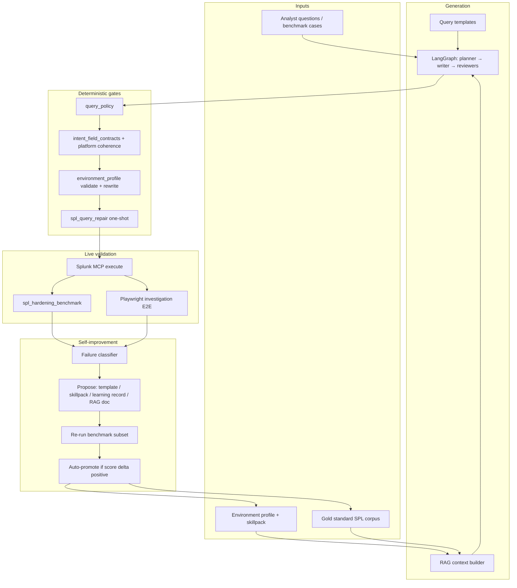

# SPL Self-Improvement Plan

**Status:** Draft plan (2026-07-28)  
**Goal:** Robust, mostly autonomous SPL quality improvement without daily human input — using gold standards, LangGraph gates, RAG/skillpack, live MCP validation, and Playwright-driven UI loops.

---

## 1. Executive summary

The failed-logon-on-`botsv3` incident is **not primarily a model failure**. The pipeline starts from a sound cross-platform template (`failed_login_activity` in `query_templates.py`), then **environment grounding** (`apply_environment_query_constraints`) corrupts it when Linux and Windows auth sourcetypes share one index. Validation and repair did not catch platform/sourcetype contradictions (e.g. `EventCode=4625` inside `sourcetype=linux_secure`).

We already have most building blocks:

| Layer | Exists today | Gap |
|-------|----------------|-----|
| Templates + gold docs | `query_templates.py`, `docs/reference/spl_gold_standard_queries.md` | Not enforced as executable oracle; drift from rewriter |
| LangGraph | Planner → writer → reviewers → validate → MCP → evidence | Zero-row runs still get high confidence; reviewer timeouts |
| RAG | Keyword scoring + skillpack + local learning | No FAISS; skillpack gitignored; no version pinning in CI |
| Benchmarks | 66+ live cases, BOTSv3 packs, hardening runner | No autonomous promotion loop; artifacts not gated in CI |
| UI E2E | `configure_e2e.py`, screenshot manifest | **No investigation SPL E2E loop** |
| Self-learning | `local_learning.py` + SPL Optimization | Manual approve; no closed-loop from benchmark failures |

**Strategy:** Fix deterministic layers first (grounding, contracts, repair), then add an **autonomous improvement loop** that runs benchmarks + Playwright investigations, captures failures, proposes skillpack/learning/RAG updates, and only promotes changes that pass gates.

**LoRA:** Defer. Improve templates, grounding, RAG, and graph topology first. Revisit fine-tuning only if hardening score plateaus after Phases 1–3.

**FAISS:** Defer. Current RAG is keyword-based (`spl_rag_context.py`). Add embedding retrieval only after `make model-rag-ab` shows keyword RAG is the bottleneck.

---

## 2. What we must fix (root causes)

### 2.1 Environment query rewriter (P0)

**File:** `scripts/environment_profile.py` → `apply_environment_query_constraints()`

**Symptoms:**
- Single-index datasets (`index=botsv3`) merge Linux + Windows sourcetypes incorrectly.
- `sourcetype=XmlWinEventLog` replaced with **first term** of a broad auth clause → `linux_secure`.
- Windows event codes left on Linux sourcetypes in `append` subsearches.
- Demo mode adds `botsv3` to the question **after** some paths run constraints; order is inconsistent across MCP chat vs Investigation UI.

**Fix requirements:**
1. **Platform-aware rewrite:** Never apply Linux sourcetype clauses inside Windows branches (and vice versa). Parse `append` / OR blocks; rewrite each branch with its own domain.
2. **Single-index cross-platform:** For `failed_login_activity`, emit explicit OR branches:
   - `(index=X) (linux sourcetypes) (linux text/event filters)`
   - `(index=X) (windows sourcetypes) (4625 / WinEventLog filters)`
   - Prefer dropping a branch over corrupting it (existing test: drop sysmon-only Windows when inappropriate).
3. **No global XmlWinEventLog → first-sourcetype substitution.** Map Windows security sourcetypes explicitly (`XmlWinEventLog`, `WinEventLog`, `WinEventLog:Security`).
4. **Constraint order:** Apply environment grounding **before** demo index substitution, or run grounding once with a structured profile object (not question-string heuristics like `"botsv3" in question` skip).
5. **New contract validator:** `validate_platform_sourcetype_coherence(query)` — fail if Windows event IDs appear under Linux sourcetypes or Linux `_raw` patterns under Windows-only sourcetypes.

**Tests to add:**
- `botsv3` single-index failed login (your exact failure shape).
- Live lab multi-index (`soc_linux` + `soc_windows`).
- Demo mode question path vs Investigation UI path — same final SPL.

### 2.2 Validation gate too weak (P0)

**Files:** `intent_field_contracts.py`, `validate_final_plan_node`, `spl_query_repair.py`

**Gap:** Contracts check token presence (`4625`, `stats`, `platform`) but not **semantic coherence**.

**Fix:**
- Add `intent_field_contracts.validate_platform_coherence(query, intent)`.
- Fail-closed in LangGraph when coherence fails; repair prompt includes explicit “you mixed Linux sourcetype with Windows EventCode”.
- Template fallback in `spl_query_repair.py` when repair still incoherent.

### 2.3 Confidence calibration (P1)

**Symptom:** `rows_returned: 0` + `cross_platform_results: false` still yields `final_confidence: 0.84` (see `multi_model_run_20260721T225925Z.json`).

**Fix:**
- Cap confidence when `rows_returned == 0` unless metadata/index tools.
- Surface “platform coverage” in UI: which branch of cross-platform query returned rows.
- Evidence reviewer prompt: penalize zero-row cross-platform auth hunts.

### 2.4 Post-writer heuristic patches (P1)

**File:** `langgraph_multi_model_soc.py` normalizer (CloudTrail, stream:http, ASA rewrites)

**Problem:** Brittle regex patches compensate for bad grounding.

**Fix:** Move intent-specific shapes into `query_templates.py` + skillpack; delete normalizer rules as templates absorb them.

### 2.5 Artifact dependency (P1)

**Paths:** `artifacts/environment/environment_profile_latest.json`, `artifacts/knowledge/spl_skillpack_latest.json`

RAG and grounding **degrade silently** when these are missing or stale.

**Fix:**
- CI/lab preflight: fail or warn if profile age > N hours or skillpack missing.
- Version-stamp skillpack in benchmark reports (`profile_hash`, `skillpack_hash`).

### 2.6 Documentation / model drift (P2)

- `docs/runbooks/spl_quality_pass.md` still references old writer defaults; sync with `runtime_config.py` / `laptop_model_profile.md`.

---

## 3. Target architecture: recursive self-improvement loop



### Loop invariants (robustness)

1. **Never promote without live MCP proof** for affected intents.
2. **Never auto-merge learning records** that narrow cross-platform intents (`failed_login_activity` guard already exists — extend to all `BROAD_INTENTS`).
3. **Golden queries are oracles** — benchmark must compare against gold SPL shape, not just keyword heuristics.
4. **Every loop iteration produces an artifact manifest** (JSON): git sha, model tags, profile hash, pass/fail counts, screenshot paths.
5. **Rollback:** learning records and skillpack are versioned files; promotion writes a new timestamped snapshot; revert = reload previous snapshot.

---

## 4. Component plan

### 4.1 Gold standard queries (expand + executable)

**Current:** `docs/reference/spl_gold_standard_queries.md` (human prose), `query_templates.py` (machine), `benchmarks/spl_cases*.json` (cases with `required_query_terms`).

**Actions:**

| Step | Deliverable |
|------|-------------|
| G1 | **`benchmarks/gold_spl_oracles.json`** — one canonical SPL per intent × environment profile variant (`live_lab`, `botsv3_single_index`, `live_multi_index`). Include `forbidden_patterns` (regex), not just required terms. |
| G2 | **`scripts/check_gold_spl_oracles.py`** — static diff: template output after env rewrite must match oracle or pass coherence validator. Wired into `make check`. |
| G3 | Sync `spl_gold_standard_queries.md` with oracles (doc follows code). |
| G4 | Add failed-login oracles for all three profile shapes (the bug you hit = `botsv3_single_index`). |

**Oracle example entry (conceptual):**

```json
{
  "intent": "failed_login_activity",
  "profile_variant": "botsv3_single_index",
  "required_substrings": ["index=botsv3", "Failed password", "4625"],
  "forbidden_patterns": [
    "sourcetype=linux_secure[^\\]]*4625",
    "EventCode=4625[^\\]]*linux_secure"
  ],
  "min_branches": 2,
  "allow_zero_rows": true
}
```

### 4.2 LangGraph improvements

**Files:** `langgraph_multi_model_soc.py`, `spl_query_repair.py`, topology eval scripts

| Step | Change |
|------|--------|
| L1 | New node **`coherence_check`** before MCP (or inside `validate_final_plan`) — platform/sourcetype validator. |
| L2 | Writer prompt: inject **resolved domain hints** from profile (`linux_sourcetypes`, `windows_sourcetypes`) instead of raw index list. |
| L3 | On zero rows for cross-platform auth: auto-run **diagnostic sub-queries** (Linux-only + Windows-only) before evidence review; attach to case state. |
| L4 | Topology eval: add dimension `coherence_strict=1` vs current; track timeout rates on 6GB GPU. |
| L5 | Repair: two-pass — (1) model repair, (2) template fallback if still failing coherence. |

**Avoid:** Adding more model stages before fixing deterministic gates (more stages = more timeout risk on laptop).

### 4.3 RAG (keyword first; FAISS optional later)

**Current:** `spl_rag_context.py` — keyword hints, skillpack intents, env context, approved learning.

| Step | Change |
|------|--------|
| R1 | **Intent-scoped retrieval:** For writer, only inject skillpack entries matching planner intent + platform tags (reduce noise). |
| R2 | **Negative examples in RAG:** On benchmark failure, append `[AVOID:…]` snippet to ephemeral prompt (not persisted until promoted). |
| R3 | **Skillpack CI artifact:** `make spl-skillpack-refresh` in lab preflight; embed `skillpack_version` in RAG output. |
| R4 | **Gold query snippets:** Index `gold_spl_oracles.json` summaries into skillpack at build time. |
| R5 | *(Optional Phase 4)* **FAISS** over `docs/reference/rag_sources/` + approved learning + gold oracles — only if `evaluate_rag_vs_vanilla_spl.py` shows ≥5pt hardening gain after Phases 1–2. |

**LoRA decision gate:** Run hardening benchmark after Phases 1–3. If writer node score &lt; 85% on auth + web + sysmon families **and** repair+template cannot close gap, evaluate LoRA on **writer only** with QLoRA on curated (question, gold_spl) pairs. Otherwise skip.

### 4.4 Local learning automation

**Current:** `local_learning.py` — manual approve/reject in UI; benchmark-gated writer scoring for new records.

| Step | Change |
|------|--------|
| S1 | **`scripts/spl_improvement_loop.py`** — nightly/cron entry point (see §5). |
| S2 | Failure → auto-create learning candidate (`spl_pattern_asset`) with status `pending`. |
| S3 | Auto-approve only if: benchmark subset passes, no forbidden pattern violations, cross-platform guard passes. |
| S4 | Auto-reject + log if candidate narrows platform scope incorrectly. |
| S5 | Repository export: `artifacts/learning/promotion_history.jsonl` for audit. |

### 4.5 Playwright autonomous testing

**Current:** `configure_e2e.py`, `capture.py` + `manifest.yaml`, configure screenshots.

| Step | Deliverable |
|------|-------------|
| P1 | **`scripts/investigation_e2e.py`** — Playwright flow: login → Investigation UI → submit question from benchmark subset → wait for result → assert SPL panel contains required terms / lacks forbidden patterns → screenshot on failure. |
| P2 | **`manifest.yaml` targets:** `investigation-failed-login-24h`, `investigation-botsv3-demo`, `investigation-linux-sudo`. |
| P3 | **`scripts/spl_autonomy_loop.py`** — orchestrator: preflight → hardening (subset) → investigation E2E → screenshots → improvement proposals → re-run subset → write manifest. |
| P4 | **`make spl-autonomy-check`** — fast subset (5 cases + 2 UI flows) for dev. |
| P5 | **`make spl-autonomy-nightly`** — full pilot pack + all investigation E2E targets. |
| P6 | Visual regression: reuse `compare.py` for investigation result panels (baseline per `CONFIGURE_UI_TAG` / app version). |

**Environment variables (mirror configure E2E):**

```bash
AGTSMITH_UI_URL=http://127.0.0.1:8787
AGTSMITH_UI_USER=...
AGTSMITH_UI_PASS=...
SPL_AUTONOMY_CASES=benchmarks/pilot_live_20_cases.json
SPL_AUTONOMY_OUT=artifacts/spl_autonomy/
```

**Screenshot on failure:** SPL text, intent badge, row count, confidence, platform coverage — stored under `artifacts/spl_autonomy/runs/<timestamp>/`.

---

## 5. Phased implementation

### Phase 0 — Baseline & instrumentation (3–5 days)

**Objective:** Measure before changing models.

- [ ] Add `botsv3` failed-login oracle + failing unit test (reproduces your bug).
- [ ] `make spl-hardening-benchmark CASES=benchmarks/pilot_live_20_cases.json` → baseline JSON in `artifacts/spl_autonomy/baseline/`.
- [ ] `make model-rag-ab` → baseline RAG vs vanilla.
- [ ] Document model tags + profile hash in every benchmark output.
- [ ] Preflight gate: skillpack + env profile freshness in `make local-lab-preflight`.

**Exit gate:** Baseline manifest committed (or stored in artifacts); repro test fails on current main.

### Phase 1 — Deterministic fixes (1–2 weeks)

**Objective:** Fix grounding and validation without touching models.

- [ ] Platform-aware `apply_environment_query_constraints` (§2.1).
- [ ] `validate_platform_sourcetype_coherence()` + LangGraph integration.
- [ ] Repair template fallback on coherence failure.
- [ ] Confidence cap on zero-row cross-platform auth.
- [ ] `make check` green including new oracle tests.

**Exit gate:**
- Repro test passes.
- `spl-hardening-benchmark` auth family ≥ baseline + 10% relative on failed-login cases.
- Manual: Investigation UI failed logon 24h produces coherent SPL on `botsv3`.

### Phase 2 — Gold oracles + RAG/skillpack (1 week)

**Objective:** Executable gold standards feed RAG and CI.

- [ ] `gold_spl_oracles.json` for top 15 intents.
- [ ] `check_gold_spl_oracles.py` in `make check`.
- [ ] Skillpack rebuild includes oracle summaries.
- [ ] Intent-scoped RAG trimming (R1, R4).

**Exit gate:** Oracle check passes for live lab + botsv3 variants.

### Phase 3 — Playwright investigation E2E (1 week)

**Objective:** UI-level autonomous verification.

- [ ] `investigation_e2e.py` (P1–P2).
- [ ] `make investigation-e2e` + Makefile wiring.
- [ ] Screenshot baselines for 3 critical flows.

**Exit gate:** E2E passes on Docker 8787 lab; failures produce screenshots + JSON report.

### Phase 4 — Closed-loop self-improvement (2 weeks)

**Objective:** Autonomous propose → validate → promote.

- [ ] `spl_improvement_loop.py` + `spl_autonomy_loop.py` (S1–S5, P3–P5).
- [ ] Auto-promote learning records (strict gates).
- [ ] Nightly cron / GitHub Actions (self-hosted lab runner) optional.
- [ ] Promotion history + rollback script.

**Exit gate:** Simulated failure → loop proposes fix → subset benchmark improves → promoted skillpack → full subset passes without human edit.

### Phase 5 — Optional advanced retrieval / fine-tuning (only if needed)

**Trigger:** Phase 4 plateau — auth family hardening &lt; 90% after 2 promotion cycles.

- [ ] FAISS index over RAG corpus + gold oracles; A/B via `evaluate_rag_vs_vanilla_spl.py`.
- [ ] LoRA writer eval on 200+ (question, gold_spl) pairs; compare to template+repair path.

**Default:** Skip unless trigger met.

---

## 6. Makefile targets (proposed)

```makefile
# Fast local gate
spl-autonomy-check:
	$(MAKE) check
	$(MAKE) spl-hardening-benchmark CASES=benchmarks/pilot_live_20_cases.json OUT=artifacts/spl_autonomy/quick
	$(MAKE) investigation-e2e CASES=5

# Full nightly
spl-autonomy-nightly:
	$(MAKE) env-profile-refresh spl-skillpack-refresh
	$(MAKE) spl-hardening-benchmark CASES=benchmarks/pilot_ready_100_cases.json
	$(MAKE) investigation-e2e
	python3 scripts/spl_autonomy_loop.py --promote --out artifacts/spl_autonomy/nightly

investigation-e2e:
	python3 scripts/investigation_e2e.py

check-gold-oracles:
	python3 scripts/check_gold_spl_oracles.py
```

---

## 7. Metrics & dashboards

Track per run (JSON + optional UI panel in Ollama Ops / Control Center):

| Metric | Target |
|--------|--------|
| Hardening pass rate (overall) | ≥ 90% pilot pack |
| Auth family pass rate | ≥ 95% |
| Platform coherence violations | 0 |
| Zero-row high-confidence rate | &lt; 5% |
| Investigation E2E pass rate | 100% on critical 5 flows |
| Mean repair invocations per case | trending down |
| RAG vs vanilla delta | ≥ 0 (RAG never worse) |
| Reviewer timeout rate | &lt; 2% |

---

## 8. Risk register

| Risk | Mitigation |
|------|------------|
| Autonomous promotion introduces bad SPL | MCP + oracle gates; pending→approved only on pass; human override in UI |
| Playwright flakes | Retry 2×; stable `data-testid` hooks in Investigation UI |
| Lab down / no MCP | Skip with exit 0 for optional nightly; fail for release gates |
| Skillpack bloat | Max N snippets per intent; prune stale learning records |
| LoRA maintenance cost | Explicit defer; trigger gate in Phase 5 |
| FAISS ops complexity | Defer; keyword RAG sufficient until proven otherwise |

---

## 9. Immediate next actions (this week)

1. **Repro test** for `botsv3` failed-login rewriter bug → fix `environment_profile.py`.
2. **Platform coherence validator** → wire into LangGraph validate node.
3. **Draft `gold_spl_oracles.json`** with 5 auth intents × 2 profile variants.
4. **Scaffold `investigation_e2e.py`** from `configure_e2e.py` pattern.
5. Run **`make spl-hardening-benchmark`** baseline and store under `artifacts/spl_autonomy/baseline/`.

---

## 10. Related files

| Area | Path |
|------|------|
| Templates | `scripts/query_templates.py` |
| Grounding | `scripts/environment_profile.py` |
| Contracts | `scripts/intent_field_contracts.py` |
| Repair | `scripts/spl_query_repair.py` |
| LangGraph | `scripts/langgraph_multi_model_soc.py` |
| RAG | `scripts/spl_rag_context.py`, `scripts/build_spl_skillpack.py` |
| Learning | `scripts/local_learning.py` |
| Benchmarks | `scripts/run_spl_hardening_benchmark.py`, `benchmarks/*.json` |
| Gold docs | `docs/reference/spl_gold_standard_queries.md` |
| Configure E2E | `scripts/configure_e2e.py` |
| Screenshots | `.cursor/skills/agtsmith-screenshots/` |
| Model defaults | `scripts/runtime_config.py`, `docs/runbooks/laptop_model_profile.md` |
