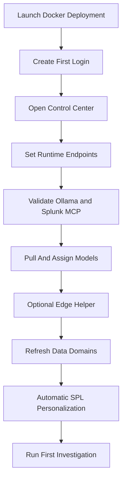

# A.G.E.N.T. Smith Initial Setup Guide

This is the primary startup path for a new deployment. The goal is simple: launch the Docker container, finish setup in the web UI, and run the first investigation. It assumes Splunk itself is already installed, but it does **not** assume Ollama, the Splunk MCP server app, model pulls, or firewall rules are already in place.

The optional edge-helper model described in the architecture docs is not required for first-day setup. The baseline deployment path still assumes one primary Ollama inference host. If you add a small edge device later, treat it as an optional routing/helper layer rather than a prerequisite. The Configuration page now supports that explicitly with an enable/disable toggle.

## Quick Start
```bash
git clone <your-repo-url>
cd splunk-soc-agent
cp config/ui.env.example config/ui.env
export AGENTCHAIN_UID=$(id -u)
export AGENTCHAIN_GID=$(id -g)
make docker-deploy-build
make docker-deploy-up
```

Then open:
```text
http://<smith-host-ip>:8787/login
```

If the deployment is fresh, A.G.E.N.T. Smith will force a first-run credential setup page before normal login.

<details>
<summary><strong>Pre-Flight Check</strong> — open this before you start if the environment is still being prepared</summary>

### Required Dependencies
1. **Ollama installed on the inference host**
   - Official site: [ollama.com/download](https://ollama.com/download)
   - Quick check:
     ```bash
     ollama --version
     curl http://<ollama-host>:11434/api/tags
     ```
   - If the tags endpoint fails, Ollama is not reachable yet.

2. **Splunk MCP server app installed on the Splunk side**
   - A.G.E.N.T. Smith expects a reachable MCP endpoint like:
     - `https://<splunk-host>:8089/services/mcp`
   - Quick check:
     ```bash
     curl -k -i -H "Authorization: Bearer <token>" https://<splunk-host>:8089/services/mcp
     ```
   - A `405` response to a simple probe can still mean the endpoint is alive; the UI validator accounts for that.

3. **Expected Ollama models pulled**
   - You can pull models manually on the Ollama host:
     ```bash
     ollama pull deepseek-coder-v2:lite
     ollama pull hf.co/MaziyarPanahi/Qwen3-30B-A3B-Instruct-2507-GGUF:Q4_K_M
     ```
   - The Configuration page will also generate the exact pull commands for the models currently assigned to each role.

4. **Required ports open between hosts**
   - Common minimum ports:
     - `11434` to the Ollama host
     - `8089` to the Splunk management + MCP endpoint
     - `8787` on the A.G.E.N.T. Smith host for the web UI
   - Quick checks:
     ```bash
     curl http://<ollama-host>:11434/api/tags
     curl -k https://<splunk-host>:8089
     ```

### Dependency How-To Summary
- **Install Ollama**
  - Install from the official Ollama installer for the target OS.
  - Start the Ollama service.
  - Confirm the tags endpoint responds.

- **Prepare Splunk MCP**
  - Install the Splunk MCP server app in Splunk.
  - Generate or obtain the bearer token used for MCP access.
  - Confirm the `/services/mcp` endpoint is reachable from the A.G.E.N.T. Smith host.

- **Pull models**
  - Pull the expected planner/writer/reviewer models on the Ollama host.
  - Re-run `Validate Current Config` in the UI until `Expected Models` no longer shows missing assignments.

- **Open network paths**
  - Allow the A.G.E.N.T. Smith host to reach Ollama and Splunk.
  - Allow operators to reach the A.G.E.N.T. Smith web UI.

</details>

## Setup Flow


## What You Need Before You Start
1. A Linux host for A.G.E.N.T. Smith
2. Network access to the Ollama host
3. Network access to the Splunk management and MCP endpoint
4. A Splunk MCP bearer token
5. Docker installed on the Linux host

## What To Do In The UI
### 1. Create the first login
Use the first-run page to create:
- username
- password
- role

This writes the initial local auth values into `config/ui.env`.
It also seeds the managed local user store used by the web UI.
The default and recommended first role is `admin`.

### 2. Open Control Center
After login, use the top navigation and hover over `Control Center`. The current product groups the administrative pages there:
- `Architecture`
- `LangGraph Graph`
- `Docs`
- `Configuration`
- `Users`

For first-time setup, open `Control Center -> Configuration` and work through the steps in order:
1. Open Initial Setup Guide
2. Fill Runtime Endpoints
3. Validate live connections
4. Assign model roles
5. Optionally configure the edge helper or leave it disabled
6. Open `LangGraph Graph` if you want to inspect the canonical graph, active topology, and latest executed path
7. Refresh Data Domains
8. Let personalization complete automatically
9. Review `Users` if you want to add more operators
10. Run the first investigation

### 3. Fill Runtime Endpoints
Set:
- `OLLAMA_HOST`
- `SPLUNK_BASE_URL`
- `SPLUNK_MCP_URL`
- `SPLUNK_LAB_BEARER_TOKEN`

These values are specific to the deployment. The placeholders in the UI are examples only.

### 4. Validate connectivity
Use `Validate Current Config`.

Do not continue until these are healthy:
- Ollama
- Splunk Base
- Splunk MCP

### 5. Install and assign models
Open `Expected Models and Commands`.

A.G.E.N.T. Smith will show:
- expected models
- installed models discovered from Ollama
- missing models

Run the generated `ollama pull ...` commands on the Ollama host for anything missing, then re-run validation.

Recommended two-model assignment:
- `Planner` -> `hf.co/MaziyarPanahi/Qwen3-30B-A3B-Instruct-2507-GGUF:Q4_K_M`
- `SPL Writer` -> `deepseek-coder-v2:lite`
- `Security Reviewer` -> `hf.co/MaziyarPanahi/Qwen3-30B-A3B-Instruct-2507-GGUF:Q4_K_M`

Normal runtime path:
- Planner -> SPL Writer -> Security Reviewer
- Peer reviewers only run when the reviewer does not cleanly approve the writer output
- Deterministic validation still decides what can touch Splunk
- Optional later extension: add a small edge-hosted model ahead of the planner for question routing and split-query hints, while keeping the primary planner/writer/reviewer roles on the main inference host.

### 6. Optional edge helper
Open `Step 4: Optional Edge Helper`.

Choose one of these intentionally:
- leave `EDGE_LLM_ENABLED=0` and continue with the primary inference host only
- set `EDGE_LLM_ENABLED=1` and provide:
  - `EDGE_LLM_HOST`
  - `EDGE_LLM_MODEL`
  - `EDGE_LLM_ROLE`
  - `EDGE_LLM_TIMEOUT_SEC`

Use this only for a small helper model that does:
- routing
- split-query hints
- cheap confidence pre-checks

Do not move the primary planner, SPL writer, or reviewer roles into this slot.

### 7. Build Data Domains
Open `Step 5: Personalize SPL With Environmental Awareness` and click `Refresh Data Domains`.

What happens now:
- on first setup, A.G.E.N.T. Smith performs a one-click bulk enrichment pass across all missing sourcetypes
- the same run automatically produces the environment-aware SPL personalization layer
- later refreshes fall back to incremental maintenance

This is the same workflow as:
```bash
make env-profile-refresh
```

The UI will show:
- live progress
- current phase
- command output

Wait for it to finish before running the first investigation.

### 8. Confirm Data Domains
After the initial build completes, confirm that the environment now shows:
- indexes
- sourcetypes
- field inventory for important sourcetypes

Important sourcetypes to check first:
- `XmlWinEventLog`
- `auth.log`
- `auth-4`
- `access_combined`

### 9. Review users and roles
Open `Control Center -> Users` if you want to:
- add more operators
- reset a password
- delete a user
- review recent query activity and who ran it

Current role model:
- `analyst`: investigations only
- `ops`: runtime configuration, validation, model assignment, and Data Domains maintenance
- `admin`: everything in `ops` plus local user management and query audit visibility

Important:
- first-run setup defaults the initial operator to `admin`
- only `admin` can open the `Users` page and see the query audit trail

### 9. Run a first investigation
Use a question that is known to match real data in your environment. Example:

```text
Investigate repeated failed SSH login activity in the last 24 hours on my linux systems. Identify the top source IPs, usernames targeted, ports used, and which host is being targeted most.
```

## Notes
- The deployment container keeps its own config volume and does not reuse the host `config/ui.env`.
- The deployment container starts with a clean artifact volume.
- It does not reuse host Data Domains or host personalization output.
- Treat each Docker deployment setup as a fresh environment bootstrap.
- Host runtime still exists for development, but Docker deployment is the primary operator path.

## Offline LangGraph Optimization
Once the main runtime is healthy, use the offline eval harness before changing the default topology:

```bash
make langgraph-gold-build
make langgraph-eval-prompts
make langgraph-topology-eval
make langgraph-topology-optimize
```

This builds a gold corpus from the current workflow, derives prompt variants, and compares topology permutations empirically.
