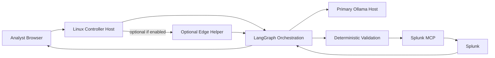
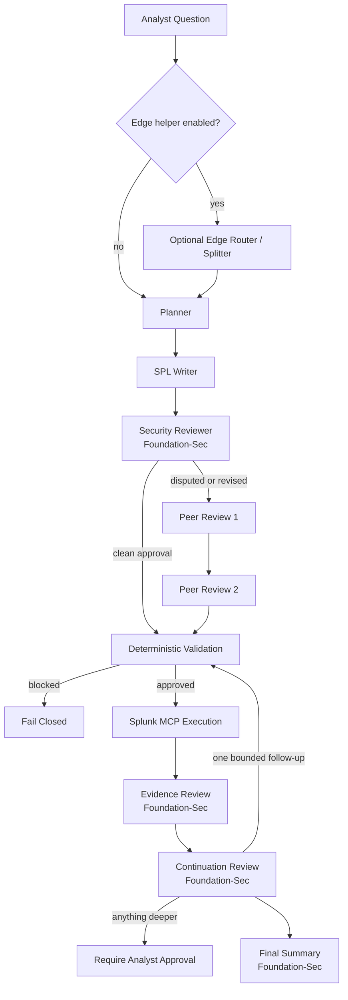
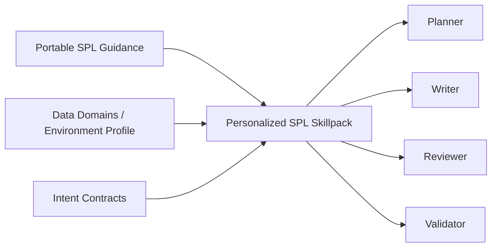

# Technical Deep Dive
## A.G.E.N.T. Smith
### Autonomous Guardrail-Enforced Networked Tasker

## 1. What The Project Is
A.G.E.N.T. Smith is a bounded Splunk analyst copilot built to help an operator investigate faster, write better SPL, stay grounded in real data, and keep every step explainable, reviewable, and read-only by design. It is not a generic chatbot, and it is not yet a response automation system. The current project boundary is disciplined investigation support: take a natural-language question, turn it into a controlled investigation workflow, retrieve evidence through Splunk MCP, and return an analyst-facing result with the query, evidence, review notes, and execution context visible.

## 2. Runtime Topology
The runtime has three main roles and one optional role:

- `Linux Controller Host`
  - runs the web UI
  - runs LangGraph orchestration
  - runs deterministic validation
  - owns audit logging and local user/accountability controls
  - is the only component allowed to call Splunk MCP

- `Primary Inference Host`
  - runs Ollama
  - hosts the main reasoning and SPL-generation models
  - receives model calls from the controller, not directly from the analyst

- `Splunk + Splunk MCP`
  - provides read-only retrieval
  - provides metadata, indexes, sourcetypes, and evidence rows
  - remains the source of truth for investigation output

- `Optional Edge Helper`
  - small LLM on an edge device
  - only participates if explicitly enabled in Configuration
  - best used for cheap routing, split-query hints, and confidence hints
  - not used as the primary planner, SPL writer, or reviewer

The important control boundary is simple:
- the browser never talks to Ollama or Splunk directly
- the inference host never talks to Splunk directly
- only the controller can execute the read-only retrieval path

## 3. LangGraph's Role
LangGraph is the orchestration layer that lives on the controller. It is the workflow engine for the investigation pipeline.

The current UI exposes a direct workflow view at:
- `Control Center -> LangGraph Graph`

In this project, LangGraph is responsible for:
- maintaining shared investigation state
- calling the planner, writer, reviewer, and summary models
- handling branching and conditional stage skips
- coordinating optional repair and continuation
- handing the candidate query to deterministic validation
- stopping the run when validation fails
- assembling the final response payload returned to the UI

That means LangGraph is not just "one model call." It is the coded workflow that defines:
- what stage runs next
- what data gets passed between stages
- when to skip peer review
- when to stop
- when to allow a bounded continuation

## 4. Current Model Architecture
The current SPL path is intentionally split across specialized roles.

Primary model roles:
- `Planner`: `hf.co/MaziyarPanahi/Qwen3-30B-A3B-Instruct-2507-GGUF:Q4_K_M`
- `SPL Writer`: `deepseek-coder-v2:lite`
- `Query Repair`: `deepseek-coder-v2:lite`
- `Security Review / Evidence Review / Continuation Review / Final Summary`: `hf.co/fdtn-ai/Foundation-Sec-8B-Reasoning-Q8_0-GGUF:latest`
- `Peer Review`: `hf.co/MaziyarPanahi/Qwen3-30B-A3B-Instruct-2507-GGUF:Q4_K_M`

Current reasoning for that split:
- Qwen is better at intent interpretation and adjudication between competing plans
- DeepSeek-Coder is better at practical query composition
- Foundation-Sec is better at security-oriented critique, evidence judgment, continuation decisions, and analyst-facing security summaries
- deterministic validation is still trusted more than either model

This keeps the project from asking one model to:
- understand the question
- write SPL
- critique itself
- repair itself
- decide whether execution is safe

That single-model pattern is harder to debug and easier to fool.

## 5. Investigation Lifecycle
The live request path now looks like this:

### Stage-by-stage behavior

1. `Optional Edge Router / Splitter`
- runs only if enabled
- helps with cheap question classification
- is a good place to detect mixed-platform prompts such as Windows plus Linux in one request
- can suggest that the controller split one broad question into separate platform-specific searches

2. `Planner`
- interprets analyst intent
- identifies likely indexes, sourcetypes, fields, and constraints
- emits a structured plan and search strategy
- does not own final SPL generation

3. `SPL Writer`
- converts the plan into SPL
- focuses on syntax, command ordering, field handling, and practical query composition

4. `Security Reviewer`
- checks whether the generated SPL matches the plan
- flags bad assumptions, wrong fields, poor filters, or risky patterns
- if it approves cleanly, the system skips peer review

5. `Peer Review 1 / 2`
- only run when needed
- used for contested or revised cases
- help adjudicate whether the reviewer rewrite is better than the writer output

6. `Deterministic Validation`
- enforces read-only behavior
- blocks unsupported commands
- checks intent contracts
- checks environment-fit assumptions
- fails closed before execution

7. `Splunk MCP Execution`
- controller calls Splunk MCP only after validation passes
- MCP executes the read-only query path against Splunk

8. `Evidence Review`
- checks whether the evidence actually answers the question
- identifies whether the returned rows are useful, weak, or misleading

9. `Continuation Review`
- decides whether one bounded automatic follow-up is warranted
- anything deeper requires analyst approval

10. `Final Summary`
- returns the analyst-facing answer, caveats, and visible context

## 6. Why Deterministic Validation Is The Real Safety Boundary
The project is intentionally designed around this rule:

- models advise
- deterministic code decides

That means the safety boundary is not the planner, writer, or reviewer. The safety boundary is the deterministic code on the controller.

It enforces:
- read-only policy
- blocked unsafe commands
- bounded query shape checks
- environment-aware intent contracts
- fail-closed behavior when the query is not acceptable

This is why the platform can safely use multiple models without letting them directly control Splunk.

## 7. Data Domains, Environment Grounding, And SPL Quality
SPL quality in this project is not driven only by prompts. It depends on three layers working together:

1. `Portable RAG`
- shipped reference material
- SPL authoring guidance
- reusable gold-query patterns
- anti-patterns and command usage

2. `Environment Profile / Data Domains`
- live index and sourcetype inventory
- known fields
- sample values
- environment-aware semantics

3. `Deterministic Contracts`
- per-intent validation rules
- expected indexes or sourcetypes
- expected fields and safe query shapes

This is why the system can improve SPL quality without turning into an unconstrained "model knows best" pipeline.

## 7.1 SPL Optimization AI Engine
The current product also includes a bounded SPL optimization workflow outside the live investigation request path.

That workflow:
- generates candidate reusable SPL assets for this environment
- benchmarks whether those assets improve future SPL writing
- records the resulting assets in a local SPL asset repository
- requires operator approval before any asset becomes active

This keeps optimization local, reviewable, and measurable. The repository is not a hidden prompt cache. It is an explicit analyst-facing control surface for reusable environment-specific SPL patterns.

## 8. Configuration Surface
The current runtime is intentionally configurable from the Control Center rather than being hidden in source code alone.

Primary model configuration now includes:
- `OLLAMA_MODEL_QUERY_PLANNER`
- `OLLAMA_MODEL_QUERY_WRITER`
- `OLLAMA_MODEL_QUERY_REPAIR`
- `OLLAMA_MODEL_SECURITY_REVIEWER`
- `OLLAMA_MODEL_EVIDENCE_REVIEWER`
- `OLLAMA_MODEL_PEER_REVIEWER`
- `OLLAMA_MODEL_PEER_REVIEWER_2`
- `OLLAMA_MODEL_AGENTIC_CONTINUATION_REVIEWER`
- `OLLAMA_MODEL_FINAL_SUMMARY`

Optional edge-helper configuration includes:
- `EDGE_LLM_ENABLED`
- `EDGE_LLM_HOST`
- `EDGE_LLM_MODEL`
- `EDGE_LLM_ROLE`
- `EDGE_LLM_TIMEOUT_SEC`

Operationally:
- the primary model host is mandatory
- the edge helper is optional and can be fully excluded from the runtime

## 9. Logging And Operator Transparency
The system now records human-readable stage logs for the investigation path. These are designed to explain what happened rather than dumping raw model text.

Current stages exposed in logs:
- guardrail
- planner
- writer
- reviewer
- peer review 1 when needed
- peer review 2 when needed
- validation
- execution
- evidence review
- summary

The final response is designed to expose:
- user intent summary
- search strategy summary
- generated SPL
- reviewer notes and caveats
- returned evidence

The Control Center graph page now also exposes:
- the canonical graph
- the active topology after current flags are applied
- the latest executed path from the newest multi-model run artifact
- the latest topology experiment ranking when eval artifacts exist

## 10. What Exists Today
Current implemented state:
- authenticated web UI
- first-run credential bootstrap
- local user management from Configuration
- query audit logging
- controller-hosted LangGraph orchestration
- two-model SPL generation path
- conditional peer review
- deterministic validation before Splunk execution
- Splunk MCP read-only execution
- evidence review stage
- continuation review stage
- environment-aware Data Domains
- personalized SPL skillpack generation
- optional edge-helper runtime configuration
- host and Docker runtime paths

## 11. What Is Planned
Current planned or likely next steps:
- stronger split-query handling for mixed Windows plus Linux requests
- better cross-platform result normalization
- broader benchmark coverage and evaluation rigor
- deeper case memory
- stronger identity and secrets posture
- eventual respond/recover integration later, not now

## 12. Evaluation Status
The project now has a first version of a separate LangGraph evaluation and topology-optimization harness.

What exists now:
- planner-backed SPL hardening benchmarks
- live planner/writer/reviewer prompt tests
- real MCP execution checks against production-like data
- BOTSv3 benchmark coverage for generalized SPL pressure testing
- a gold-corpus builder for the LangGraph pipeline
- eval prompt generation from gold cases
- topology experiment configs
- a topology runner that scores multiple workflow layouts
- an optimizer script that ranks the current best experiment

What that means in practice:
- the LangGraph path can now be evaluated as an offline subsystem, not only through ad hoc prompt checks
- the two-model flow can be compared across different stage layouts
- reviewer, peer review, evidence review, summary, and repair stages can be measured empirically
- live MCP-backed gold-corpus generation has been confirmed against the current environment
- a minimal live topology eval has been confirmed against the current environment

What is still missing:
- broader live gold-corpus generation against a larger connected dataset
- stronger automated evaluation of mixed-platform split-query behavior
- more formal branch-coverage reporting around state transitions
- richer cost and token accounting by stage

So the honest answer now is:
- yes, the project does have a first standalone LangGraph eval framework
- no, it is not fully mature yet; it still needs broader live datasets and deeper scoring coverage

## 13. Operational Boundary
A.G.E.N.T. Smith is currently for Detect, Triage, and Investigate. It is moving toward TDIR, but it deliberately stops short of autonomous response.

That is an intentional design boundary:
- no autonomous response actions
- no uncontrolled tool use
- no direct model-to-Splunk execution path
- no trust without validation

The current identity posture is also deliberately bounded:
- local web UI users
- local audit logging
- no enterprise IAM integration yet
- no centralized audit pipeline yet

## 14. Read This Next
- [project_one_page_white_paper.md](project_one_page_white_paper.md)
- [two_model_spl_pipeline.md](../architecture/two_model_spl_pipeline.md)
- [langgraph_eval_optimization.md](../architecture/langgraph_eval_optimization.md)
- [system_design.md](../architecture/system_design.md)
- [initial_setup.md](../runbooks/initial_setup.md)
